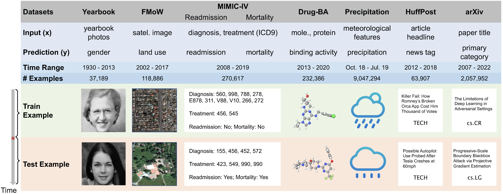

# Wild-Time: A Benchmark of in-the-Wild Distribution Shifts over Time

**Note**: This is a preliminary version of the Wild-Time benchmark. We are working on code refactoring and will release the final version in 1-2 months.

## Overview
Distribution shifts occur when the test distribution differs from the training distribution, and can considerably degrade performance of machine learning models deployed in the real world. While recent works have studied robustness to distribution shifts, distribution shifts arising from the passage of time have the additional structure of timestamp metadata. Real-world examples of such shifts are underexplored, and it is unclear whether existing models can leverage trends in past distribution shifts to reliably extrapolate into the future. To address this gap, we curate Wild-Time, a benchmark of 7 datasets that reflect temporal distribution shifts arising in a variety of real-world applications, including drug discovery, patient prognosis, and news classification.



If you find this repository useful in your research, please cite the following paper:

```
@inproceedings{yao2022wildtime,
  title={Wild-Time: A Benchmark of in-the-Wild Distribution Shift over Time},
  author={Huaxiu Yao and Caroline Choi and Yoonho Lee and Pang Wei Koh and Chelsea Finn},
  booktitle={ICML 2022 Shift Happens Workshop},
  year={2022},
}
```
We will release the arXiv version of our paper, along with the final code repository, in 1-2 months.

## Prerequisites

- huggingface-hub 0.5.1
- pytorch-tabular 0.7.0
- pytorch-transformers 1.2.0
- pandas 1.4.2
- PyTDC 0.3.6
- pytorch-lightning 1.5.9
- pytorch 1.11.0

## Datasets and Scripts


- MIMIC-IV
  - Follow the instructions in `../src/data/mimic/get_mimic_table.ipynb` to download the datasets and get `data_preprocessed.csv`
  - Run `../src/data/mimic/preprocess.py` to get `mimic_preprocessed_readmission.pkl` and `mimic_preprocessed_mortality.pkl`
  - Refer to the corresponding running scripts in the `scripts/` folder

- All other datasets (Yearbook, arXiv, Huffpost, Drug-BA, Weather-Pcpn):
  - Download the data from [Google Drive](https://drive.google.com/drive/folders/178Os-zwyJ7yL7aBxcR7Il5_0wwiYYqGl?usp=sharing) into the folder `./Data`
  - Refer to the corresponding scripts in the `scripts/` folder

## Acknowledgement
We thank the authors of all baselines. Most of our implementations follow the corresponding original released versions. We gratefully acknowledge the help of Zhenbang Wu in the preprocessing of MIMIC-IV dataset.
